# 组件的细节

## 受控组件
### checkbox(多选)

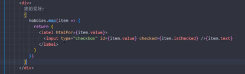

这样就能够在表单提交的时候通过 hobbies 对象获取需要的数据 ..

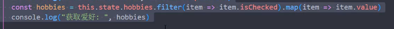

数据源: 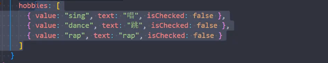

### select(多选)

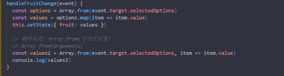

通过selectOptions 选取多选select选中的选项 ..

### 非受控组件
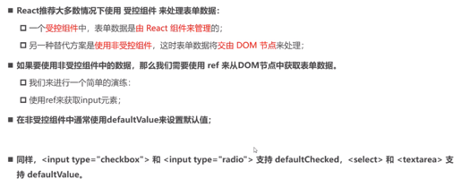

## 高阶组件
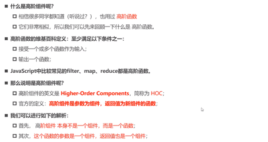
  
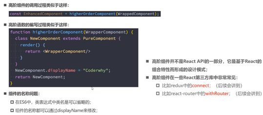

### 示例
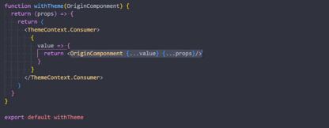
然后使用的时候,只需要简单函数调用增强,这个示例使得应用多个上下文作为属性 特别简单,我们只需要注意属性名重复问题 ..

### 意义
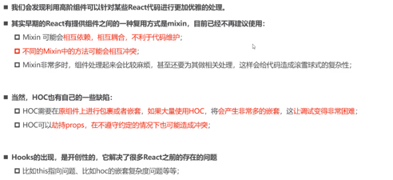

## Portal

意义是门户的意思?

也就是让组件渲染在多个地方存在可能,也就是多个路由出口的感觉 ..

它接受一组组件children,以及挂载的dom 根
  
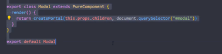 

## fragment 碎片
有两种形式:
1. <>
2. `<Fragment>` 可以添加key 属性 ..

## 严格模式(StrictMode)

1. 识别不安全的生命周期
2. 识别不安全的ref使用方式
3. 检查的意外副作用
4. 废弃的findDomNode 方法

    可以直接获取组件所挂载的DOM 元素
5. 检测过时的context api

    早期通过static 属性声明Context 对象属性,通过getChildContext 返回Context对象来使用
    
    已经废弃 ..
 
此模式会在开发模式中使用(它会故意的执行constructor 、render函数多次 来故意测试副作用影响) ..
 
## 过渡动画

1. react-transition-group
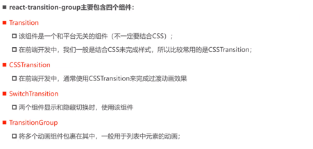
  
### 使用CSSTransition
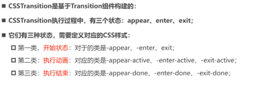

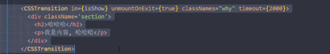

然后编写进入动画, 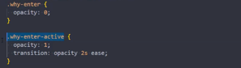

也可以写移除动画 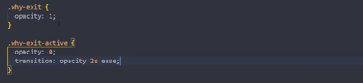

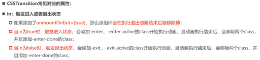
上面的截图中, 当in = false的情况下,结束的时候,应该是 exit-done ..

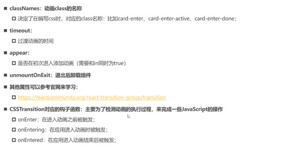

appear 需要和in 保持为true的情况下,第一次渲染元素的时候应该如何添加css样式 ..

### SwitchTransition

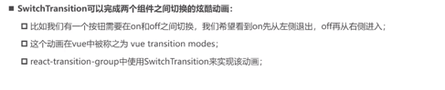

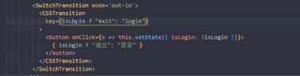

能够将两个组件进行动画切换 ..

上述截图这只是其中一种方式(仅仅切换按钮的字变化的情况下,重新切换渲染)

它的模式好像只有 in-out / out-in ,但其实在两个组件切换的过程中,可能存在同时进行 ...

那么就需要使用TransitionGroup来代替:
### TransitionGroup

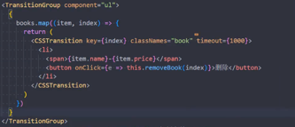
