# css 样式 

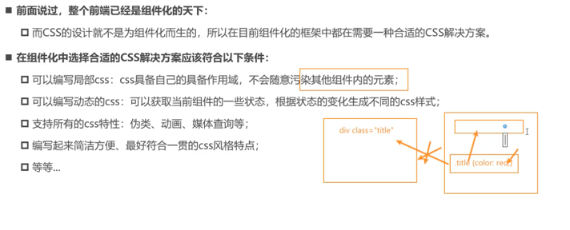
## 内联样式

填入 style js对象作为样式填充 ..

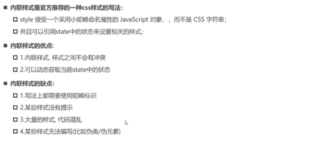

这种方式在通过代码控制样式的情况下特别有用 ..

## 普通css

优点,批量应用样式,缺点就是全局生效 ..

但是通过约定大于配置的方式可以解决一部分问题 .. 

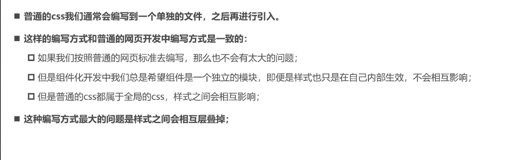

## css modules

模块化,局部可用,不会和其他组件模块样式冲突 ..
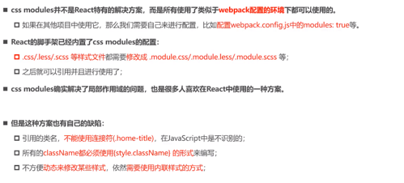

### create-react-app config(craco)
```shell
npm install @craco/craco
```

如果无法安装craco5,那么可以安装@craco/craco@alpha

例如用这个配置来 添加 less css文件支持 ..
```shell
npm install craco-less
```
如果出现问题,应该也是craco5安装问题,所以依旧使用开发版本`alpha` ..

## css in js

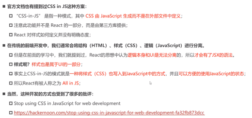
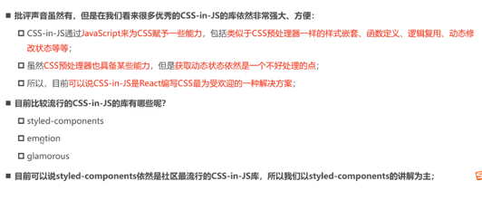

### styled-components
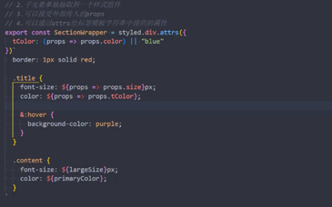

这种方式,将css样式封装到一个组件中,并且支持细分样式到内嵌组件来形成更好的代码结构 ..
并且由于组件可以传递属性,那么能够将js 变量随意的放入 这种css in js结构中,通过模版字符串随意引用 ..

如上代码所示 ..

但是如上代码对于提供默认值的attrs方法中的tColor的写法存在问题 ..
(应该是提供一个函数,当不存在color 属性传入的情况下,使用`blur` )

以下形式正常执行效果:
 
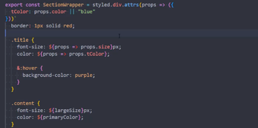

此组件的插件styled-components 样式提示)


其次,还可以全局定义一些变量在js模块中,通过导入形成良好的变量声明规范,能够减少代码修改范围,同时可以尝试编写更多模版
css 组件来形成良好的网站风格 ..

但是这种方式应该通过更好的方式,全局主题样式(提供变量,如下所述)

#### 子css 组件嵌套

styled-components中的 子css组件嵌套 ..

1. 子组件分割
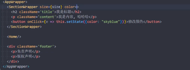

每一个组件会有根样式的分割 ..

但是内部的样式可能还是会被覆盖,如果遵循css样式优先级,但是只要遵循约定,那么一般是不会相互污染的 ..

2. 全局主题样式 提供变量
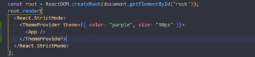

然后在css in js 组件内部可以通过模版字符串的方式获取数据流中传入的Props
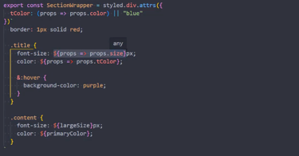

然后加以使用 ..

### 样式继承

这其实是一个很自然而然的过程, 根据css规则,大范围的样式必然对组件内部生效 ..

例如:
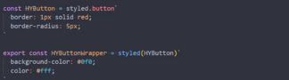

这样HYButtonWrapper 具有外部组件(HYButton)的样式 ..
一个高阶组件的用法 ..

## 动态添加class的库
1. classnames

    通过三元表达式增加 classname 比较繁琐
    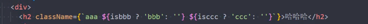
    
    所以,我们可以更加简单
    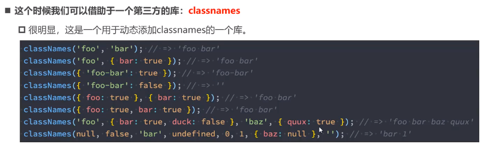

