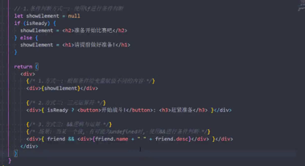

# react jsx

## 是什么?
1. Jsx 是一种js 语法扩展,称为 js xml,因为看起来像xml语法 ..
2. 描述UI界面,并且完全可以和JS融合在一起使用

## 基础使用
1. 规范
   1. jsx 必须存在一个根元素
   2. 根元素也可以是碎片(符号是: <>)
   3. 标签可以是单或者双标签(也就是标签对齐),单标签必须以 /> 结尾 ..
   4. 注释编写
   
        html 使用 <!-- --> 编写注释
        
        Js中使用 // ,那么jsx中需要
        
        { /* */ } 的方式编写注释 ..
   5. {} 表达式的规范
      1. 当为基础数据类型,则直接显示(字符串,数值,数组)
      2. 如果是 空值(null / undefined / boolean) 显示为空
      3. 对象(Object)类型无法被 {} 表达式解析 ..
   6. jsx 绑定属性
   
      也就是类似于方法调用的方式赋值绑定即可
      
      1. class 以及 style 属性绑定
      
         1. 应该通过className 绑定
         2. 第三方库classnames 来实现更方便的class绑定
   7. this 指向问题
      1. this 存在4种绑定方式
         1. 默认绑定(直接在普通环境中执行函数) 是否为严格模式具有this 指向window 或者undefined的情况
         2. 隐式绑定 在通过对象调用方法的情况下(例如 obj.toString())
         3. 显式绑定 通过call / apply / bind 方法来显式绑定this
         4. new 绑定 也会存在this绑定 通过(new 一个函数) 也是绑定
      2. 那么绑定this 就可以通过三种方式处理
         
## 条件渲染

其中通过 && 逻辑和运算,能够利用Boolean类型渲染为空的特性来直接利用Elvis运算符的好处(elvis(??,false)) ..

## 原理和本质