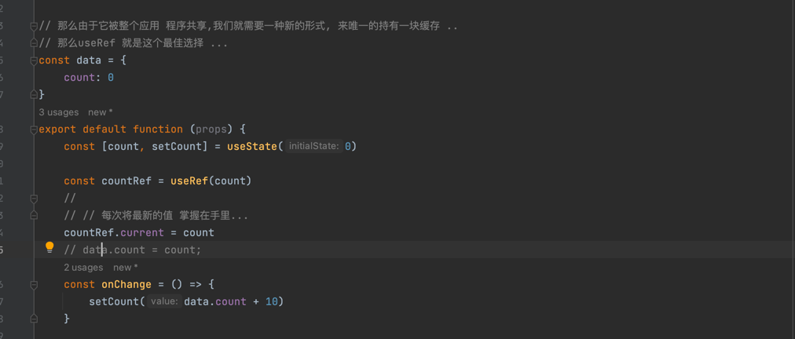

# 函数式组件

## hook 钩子

1. 只能在函数式顶层函数作用域内使用
2. 不能条件调用(设计到底层数据缓存)
3. 在钩子内部使用钩子(允许)

## 基础hook

1. useState
2. useEffect
3. useContext
4. useReducer

   它是对复杂的state的一个类似于redux的数据管理,它和redux没有任何关系,它仅仅是基于redux的方式进行state的不可变数据的处理(
   通过action 进行反应state)

   

   只不过它维护的是state的数据 ..

   其次,useReducer是一个钩子,那么它的内部是可以使用其他钩子的 ..

   例如很少使用的,useReducer + useContext 进行数据共享 ...
5. useCallback
   下面是一个经典的闭包陷阱:
   

这其中陷阱就是pagination
被hook钩子缓存了,然后钩子每次就是之前的函数,那么导致之前函数对searchFormData的引用,就永远不会变化. .

那么解决这个问题的办法,就是将pagination中的这些函数做成纯函数 ..

现在我正确理解一下纯函数(有确定的输入和确定的输出,一定的输入总是得出一定的输出) ...

那么这里面,使用了一个隐式输入(非纯函数) ...

那么我们通过改变为纯函数,也能解决这个问题,通过使用这个函数改变为触发其他state的变化,
然后将对应的有些东西放在(render 过程中 拉入的一些hook中,例如 useEffect),将useEffect中触发数据的设置 ..

这样保证,在这些钩子中使用的函数都是使用的正确的闭包变量引用 ...

那么下面的解决方案,核心就是 得到正确的闭包变量引用,将缓存的pagination 刷新为新的对象(具有新的函数 -
具有正确的闭包变量引用)


所以useCallback,不是说减少每次引用函数的次数,而是 在合适的时候使用新的函数,从而触发 组件刷新(state,props
更新导致render刷新)

但是我们还有其他方式解决闭包陷阱 ...

### 那就是useRef

首先useRef 在组件没有清理的时候,每次都会返回同一个缓存对象,那么我们将需要
查看的对象放在current属性中,应该是一个好事情 ..



所以,useCallback 仅仅在减少子组件的重复渲染的次数时才会具有性能优化 ..

6.useMemo

它的本质就是对函数的结果进行优化,例如一个函数用来计算某些东西,那么 仅当某些事物发生改变的时候,才需要触发函数执行(
那么这就是一种性能优化),
那么这种本质也叫做依赖检查 ..

那么它做性能优化,包括当前组件内的渲染也包括对子组件的重复渲染减少 都具有效果 ...

因为它的含义是,在恰当的时机返回新的结果 ...

有些时候你完全可以基于useMemo的返回值 来决定子组件是否刷新 ...

其实useCallback 和 useMemo 本质很像 ..

useCallback(fn,[depends])  == useMemo(() => fn,[depends])

当条件成立,一个返回新函数,当条件成立,一个返回函数结果值(那么这种情况下,返回函数,等价useCallback)

但是,由于react的 优化规则(例如使用纯函数, memo())
都是进行浅比较,也就是说如果是基础类型值,那么是值比较,如果是对象,那么就是地址/引用比较 ..

那么,在这种情况下, 通过useMemo的作用就很大了,仅当某些东西发生了变化才需要 更新组件(
而且不在更新看似一致的对象为新对象来导致组件重复渲染) ...

那么如果完全不会发生变化,那么其实定义在组件外部作为一个常量值可能也是一个解决方案 ..(这样,也不会创建lambda -
useMemo的函数参数 - 其实一样,每次都会创建),
除非你定义在外部作为引用不变的函数... (那么其实都指的是一件事情, 引用不变) ...

所以react 优化细节太多了,但是还是围绕着 (对象 /值的比较方式来进行 组件的重复渲染优化), 对象比较时间/速度/质量根据
shouComponentUpdate 生命周期钩子来决定 ...

7.useRef

1. 绑定DOM
   2.保存值(在组件生命周期内,都可见最新值,解决闭包陷阱,当一个函数引用了闭包中的变量,那么可以通过此Hook解决闭包陷阱)

8. useImperativeHandle

   用来解决useRef 获取子组件内部Dom元素时,控制外部ref 对此DOM的权利 ...

```js
// const Child = memo(forwardRef((props, ref) => {
//     console.log("render")
//     return (
//         <input ref={ref}></input>
//     )
// }))
// 上述通过 memo 包裹没有任何性能优化
// 因为属性 / state 都没有发生变化(对于子组件来说)
// ref 保持不变 ..
// 控制父组件行为,看下一个组件
// const Child = forwardRef((props, ref) => {
//     console.log("render")
//     return (
//         <input ref={ref}></input>
//     )
// })


const Child = forwardRef((props, ref) => {
    // 主打的一个作用就是装饰/ 封闭/覆盖、代理的作用 ..
    // 通过这个,我们子组件可以选择,是否暴露确定的方法给外组件
    useImperativeHandle(ref, () => {
        const data = {}
        Object.defineProperty(data, 'value', {
            set(val) {
                console.log("set")
            },
            get() {
                console.log("get")
            }
        })

        return data
    })
    return (
        <input ref={ref}/>
    )
})

export default function (props) {
    const ref = useRef();

    return (
        <div>
            {/*// 我们发现这种方式 父组件的权利太大了*/}
            <button onClick={() => {
                ref.current && (ref.current.value = '')
            }
            }>清除
            </button>
            <button onClick={() => {
                ref.current && (ref.current.value = '赋值')
            }
            }>赋值
            </button>
            <Child ref={ref}/>
        </div>
    )
}
```

所以本质上就是使用现有对象 覆盖已有对象的部分属性(行为) ... 主要结合 useRef 使用...

10. useLayoutEffect


那么这种东西,应该没有场景需要它 ... (它会在dom渲染在界面之前进行执行 ) ...

执行阶段就是(render函数 -> useLayoutEffect ->  dom 更新 -> useEffect)

突然有一个注意点: 就是 非子组件的函数式组件的 性能优化(那么只能靠, useMemo / useCallback 来尝试优化了 .. -
例如依赖性检查,另一个值是否发生变化)

11. 自定义Hook
    规则,必须以use开头,那么通过自定义hook我们可以函数化封装一批逻辑,能够被多个组件共享使用 ...

例如下图中,定义了简单的自定义hook，然后复用,为每个组件增加了生命周期日志回调 ..


第二个示例,组合自定义上下文,通过上下文传递一些需要共享的数据,这也是自定义hook的一种使用方式 ..

第三个示例,就是通过hook 形成代码复用,例如 获取页面滚动位置 ..(并不是每个组件都写一份自己的逻辑 ..) ..

所以通过自定义hook,你能够复用监听这些副作用 ..
所以增强一个组件的功能,除了高阶组件,也有自定义hook,但是高阶组件的能力更强大 ..

第四个案例:


但是这个代码中,通过useEffect 感知data的改变,这会触发多次刷新, 还可以更改一下, 将useEffect这个hook 直接改为monkey
patching,
也就是将返回的setData 触发setData函数调用以及设置localStorage的值(例如setState的
在真正渲染的时候的触发时机来做可能也是更好的)

   ```js
        setData(() => {
    xxx
}, triggerLocalStorageChangeFunc)
   ```

12. userId


### ssr 同构应用


### 作用


13. useTransition

本质上就是用于协调组件之间的刷新优先级(render),例如当你点击一个动作的时候,需要执行大量CPU时间的代码,那么 这可能导致
你有些关键需要迅速响应的组件和另一个组件一起刷新,那么此时需要有渲染优先级 ...


上面这个示例说的是,当我的列表数量很多的时候,我通过输入框过滤,那么在执行过滤的情况下
消耗大量CPU时间,所以导致输入框的响应也非常慢 ..
此时,我们的解决方案应该是快速让输入框响应,而让列表处于Loading中,当完成之后重新渲染列表 ..

当然useTransition 仅仅是改变渲染优先级的一种方式 ... 还有其他的方式(例如结合结合宏/微任务来执行) ...

14. useDeferredValue

等价于 useTransition


改变为使用此hook 创建需要更新的数据的副本,然后延迟刷新 ..


它主要不能提供加载状态,如果需要还是可以使用useTransition ..

查看此示例了解更多: https://zhuanlan.zhihu.com/p/425009300

