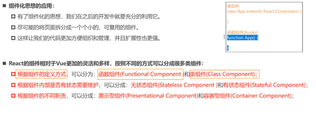
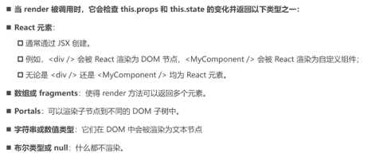
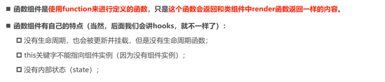
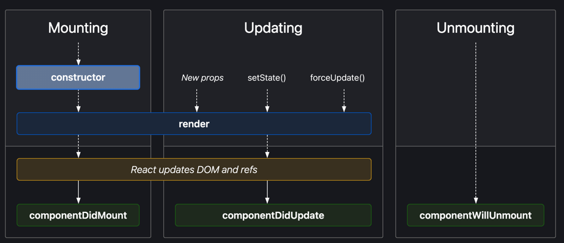
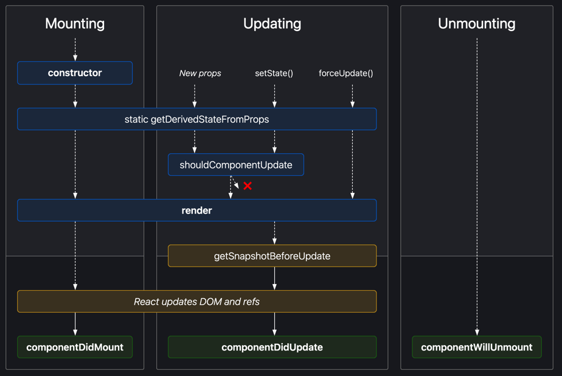
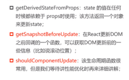
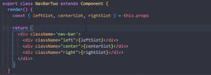
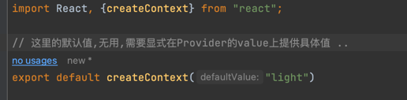
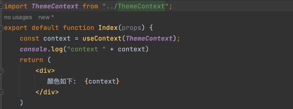

# react 生命周期钩子以及组件化



## render 函数
1. 它的返回值

    

## 函数式组件


## 生命周期
1. 简单生命周期


我们能够看出,在挂载的时候,会先调用render函数,然后再调用DidMount,在更新的时候,有多种方式触发更新,取消挂载也是类似的 ..

查看[官网](https://legacy.reactjs.org/docs/react-component.html#the-component-lifecycle) 了解更多

2. 不常见的生命周期

能够看出,挂载的情况下,会先调用静态方法(getDerivedStateFromProps) 但是它不会调用更新所进一步的函数(shouldComponentUpdate)
所以, 有一些不常用的生命周期可能在特殊情况才需要使用 ..
   
   

   查看[官网](https://legacy.reactjs.org/docs/react-component.html#rarely-used-lifecycle-methods) 了解更多
3. vscode 代码插件
   ES7+ React/Redux/React-Native snippets 插件,快速给你一定量的代码片段
4. 组件通信
   
   1.propsType 库的使用,用来验证props 类型
   
   [官网](https://legacy.reactjs.org/docs/typechecking-with-proptypes.html) 已经不推荐使用,并且通过ts来进行类型校验

   2. 在react中props特别强大,所以我们可以让父组件将回调参数传递给子组件,子传父的情况下,调用这个回调函数即可 ..

   3. 组件作为属性传递
      
      1. 通过props.children 进行插槽概念的处理
         
         
         不是很方便,当传递一个作为一个组件的子组件时,它的children 不是数组,多个的时候则是数组,相反,props更加灵活 ..
         
         它的形式类似于
         ```xml
          <MyApp>
            // 它是一个子组件传递
            <App1></App1>
          </MyApp>
         ```
      2. 通过props 来随意的传递想要的组件 
         

         它的传递形式如下:
         
   3. Context 应用
      
      在数据传递的过程中,存在各种形式,例如父子传递,非父子传递,那么此时,一层一层的传递太麻烦了,所以开发了上下文API,这就是它的作用之地 ..
      
      首先创建一个上下文
      

      其次,将消费此上下文的组件包裹在上下文中
      

      并且需要提供Value属性 .. 最后在消费组件中使用
      
      来实现消费 ..
      
      或者通过以下方式消费:
      
      传递一个函数给上下文消费者 ..
      
      对于类组件,通过类的contextType属性来决定你消费的是哪一个上下文 ..
      ```jsx
        MyApp.contextType = ThemeContext
      
        // 然后通过 this.context.[attr] 进行属性访问
      ```
      
      对于多个消费的情况下,就使用上下文消费者消费对应上下文的属性 ..
      ```jsx
       <OtherContext.Consumer>
        {/*// 处理方式*/}
       {/*{ value => { ... }}*/}
      </OtherContext.Consumer>
      ```