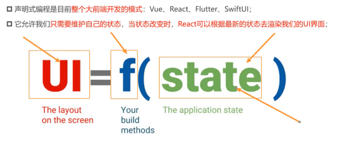
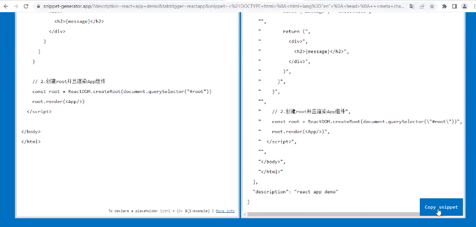
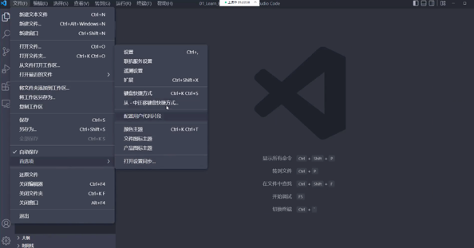
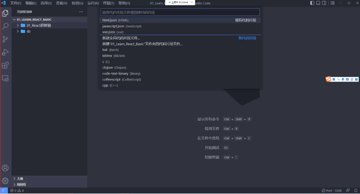
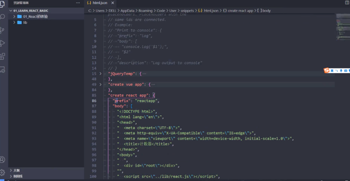

# react study

## react 是什么
1. 用于构建用户界面的js库 ..

## 学习方式
1. 官方文档
2. 看书学习
3. 开源项目(学习)
4. 视频课程

## react 初识
1. 声明式编程

2. 多平台适配
类似于java的形式,一次编译多个平台运行 ..
   1. react
   2. react native
   3. react vr(虚拟现实)

3. 学习模块列表
   1. 基于html形式的js 代码运行(html-js-react)
   
    需要三个包:
   1. react(react 核心代码)
   2. react-dom(适配渲染不同平台的代码)
   3. babel(将jsx转换为 react js代码)
   
      通过<script type="text/babel"/> 的方式来编写jsx 代码 .
   
   这种方式是通过在html上直接使用react的方式,但是不推荐 ..

   [官方链接指南](https://react.dev/learn/installation#try-react)
4. 学习工具使用
   1. VSCode 代码片段
      有利于重复利用代码片段,节约时间 ..
   
      1. 复制需要生成代码片段的代码
      2. 在 https://snippet-generator.app/ 网站中生成代码片段
      3. 在VSCode 配置该网站上生成的代码片段 
         
         
         
         
      
         保存好即可 ..