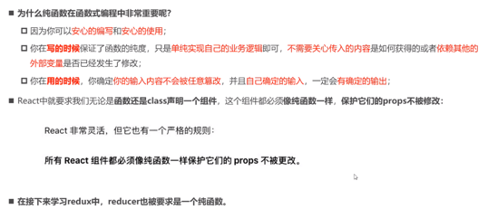
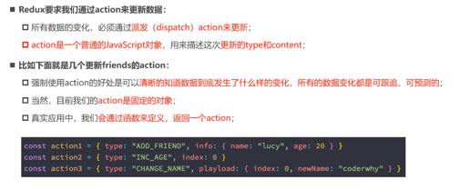
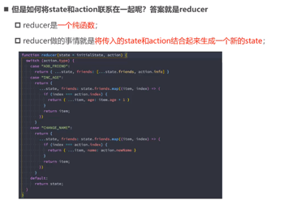
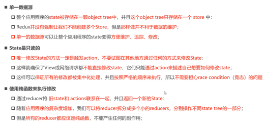
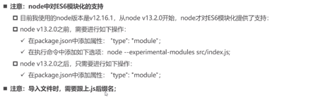
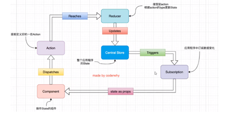
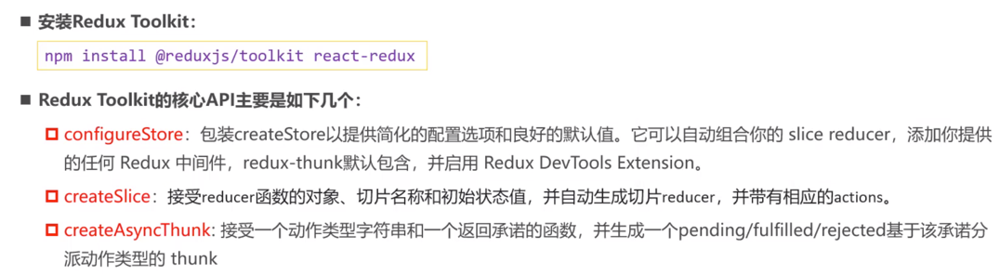
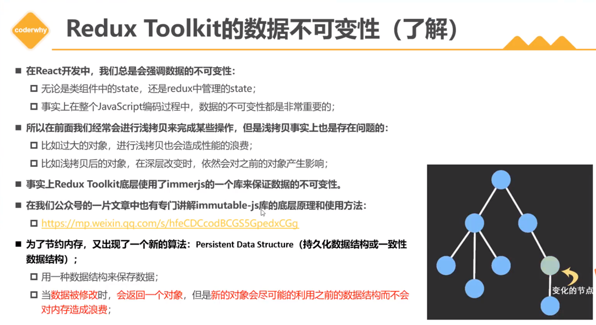
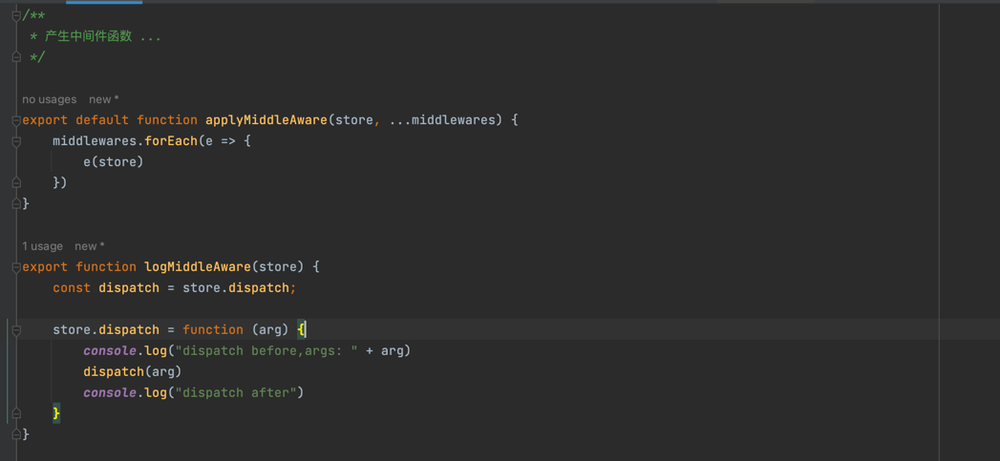

# redux

## 纯函数

1. 一定的输入产生一定的输出(并且无论调用多少次保持一致)
2. 不具备副作用(例如影响输出以外的任何内容)
3. 纯函数主要特征就像是保持一致的工作流程 ..



## store

通过外部存储state 来保持复杂数据缓存 ..
###  action


### reducer


### 如何使用

1. 概念

2. 详情查看 react-in-redux目录中的实践
3. node 对es 6模块导入支持



4. 工作流程
  

### redux-thunk

 进行异步action 扩展

### redux devtools

上面提示了如何在开发阶段使用 redux devtools 来调试程序 ...
https://github.com/zalmoxisus/redux-devtools-extension

### reduxjs/toolkit



1. configureStore

 能够合并slice(也就是raw reducer, 其次你还可以提供中间件,middleAware)
 
2. createSlice

 将之前在reducer中的case 语句拆分为 单个函数(作为需要条件执行的动作 - action)
 
 也就是可以导出自动生成的action,以及 reducer(raw reducer)

3. 简单使用示例,查看 react-redux-toolkit

4. 异步 react-redux action

依旧查看 react-redux-toolkit
5. 数据不可变性
https://mp.weixin.qq.com/s/hfeCDCcodBCGS5GpedxCGg
 

但是我认为，对于简单对象的  拷贝，两者的牺牲是一样的 ... 


### 候补丁(monkey patching)

也就是redux中使用的中间件原理 ...

#### 假设我们想要 对派发的action 进行日志记录,应该如何做

1. 那么必然需要通过改写dispatch来实现这样的效果 ...



应用
```js
// applyMiddleAware(store, logMiddleAware);
```

但是redux 是怎么做的呢 ..
函数柯里化,来嵌套 dispatch 函数 ..

```js

export function reduxLogMiddleAware() {
    return next => {
        return action => {
            console.log("dispatch before - redux, action: " + action)
            next(action)
            console.log("dispatch after - redux")
        }
    }
}

export function reduxThunkMiddleAware() {
    return next => {

        // 这里为什么需要将next 函数记录一下 ..
        // 因为action 执行的函数(有可能继续派发 函数式action),那么如果使用 raw(原始next) 则无法处理 ..
        // 于是,我们通过 将新的next 记录,让它继续使用新的next 来解析函数式action
        // 才能够使得流程正确 ...
        // 这也是为什么 中间件是一个柯里化函数 ..
        // 因为就是monkey patching ..
        const raw = next;
        next = action => {
            if (action instanceof Function || typeof action === 'function') {
                console.log("函数 action")
                action(next)
            } else {
                // 执行 ...
                console.log("普通action")
                raw(action)
            }
        }

        return next;
    }
}


// 将柯里化中间件 执行重组 dispatch 函数 ...
export function reduxApplyAware(store, ...func) {
    let dispatch = store.dispatch;

    func.forEach(e => {
        store.dispatch = e(dispatch)
        // 继续交替 ...
        dispatch = store.dispatch
    })
}
```

应用
```js
reduxApplyAware(store,reduxLogMiddleAware(),reduxThunkMiddleAware());
```

所以其实本质上 redux-thunk的原理很简单 ...