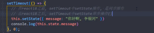
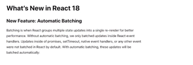
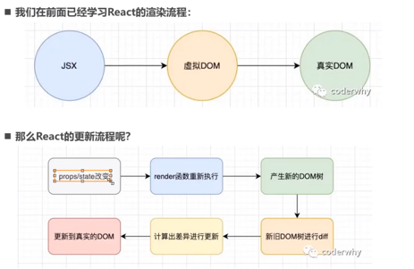
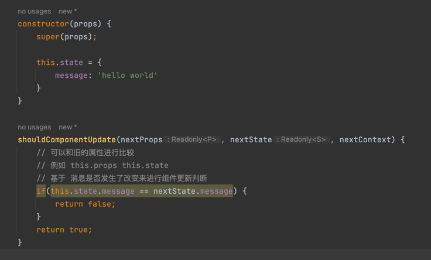
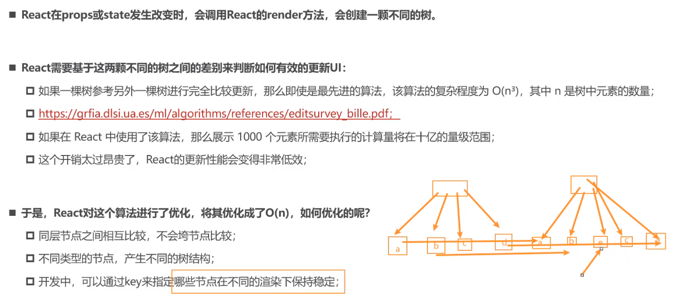
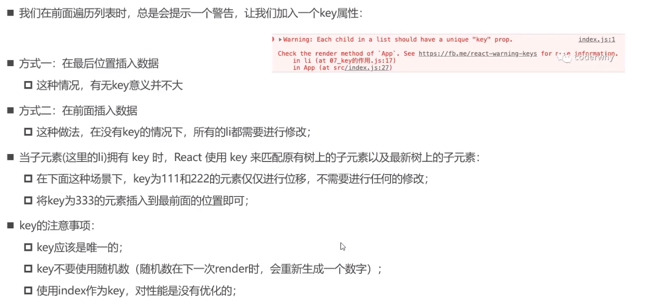
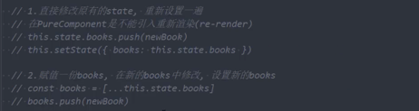
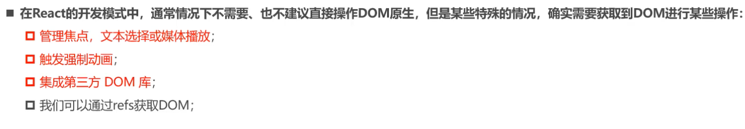
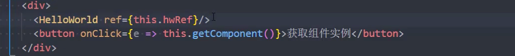

# setState

## 为什么要使用它

触发视图更新 ..

## 使用方式
1. 直接传递对象和原有对象进行合并(延迟合并, 性能优化)
2. 直接传递一个函数(带有更新之前的 state,props) 能够交给这个函数作为输入 ..
    
    优点是: 总是能够拿到最新的值(自从上一次更新之后)
 
3. 传递一个参数和回调
   
   回调将在数据合并完成之后,执行回调 ..(在我们关心什么时候合并完成的时候,可以使用它) ..

## 异步更新
1. 此方法在React中的事件处理就是异步的 。。
2. 当在传递函数的情况下,通过this拿取一个state的值,那么在一批state合并中,会导致this.state永远是更新之前的值,
   这将导致错误 ..
   (依靠队列的特性 来将每一次state 修改入队,保持顺序合并)
## 为什么是异步的?
1. 性能优化,批处理一批setState, 减少render次数 ..
2. 当如果将setState设置为同步,此时如果render未执行,那么 state 不能和props保持同步 ..
3. 如果state 和Props不能保持同步,那么开发中会出现很多问题 ..
   具体情况就是, 父子通信中,父亲的state更新了,但是 子组件中的Props将可能不能够和父的state保持同步,这可能是非常大的问题 ..

[github issues](https://github.com/facebook/react/issues/11527#issuecomment-30199710): 解释了这个问题

## 在React 18之前, 有些setState是同步的
1. 在React的事件处理中是异步的
2. 其他情况是同步的(例如setTimeout 宏任务中的代码执行,或者Html 原生dom 事件)

   这意味着同步修改,代码是顺序执行,更改能够立即可见..
   
   否则异步处理,放入队列异步处理,则后续代码必然比异步代码块先执行 ..

3. 如果需要强制更新

   那么可以用特殊函数做一次处理,来自react-dom的flushSync 函数 ..
   

## React diff算法

### 性能优化SCU

表示shouldComponentUpdate 的简写

我们根据生命周期可以知道,SCU 执行在render函数执行之前 ...

那么我们能够拿到更新之后的state,props等数据来尝试判断是否需要刷新来实现性能优化

但是,如果我们需要在开发中不断协调各个组件的SCU 这就是噩梦 ..

所以我们需要使用PureComponent 组件 ..

我们在下面了解更多 ..

#### 更新

在面对两棵树出现不同的类型节点时,直接全部替换 ..

其次,在对比同级节点的时候,通过key来进行dom复用,保证算法的高效性 .. 例如 C / E 进行了替换位置,那么这种情况下通过key能够进行复用,从而提高性能 ..
#### key的优化

#### PureComponent 组件使用 进行SCU 优化

但是原理很简单,它浅比较state / props之间的不同,如果有不同,那么则发生render,否则不更新 ..

浅比较,表示比较第一层,基础数据类型,对象(引用)类型浅比较 ..

对于函数式组件,对比props 不同,使用hooks(memo)

##### state 的不可变数据的力量

由于纯函数引起的SCU性能优化,所以,如果你直接在state进行修改后,直接调用state设置为原始的对象,那么纯函数的浅比较就没有意义了 ..

所以在state中的对象引用类型,建议是 使用不同对象进行覆盖 ..

这样纯函数浅比较则能够更好的生效 ..

### ref 使用

 
#### 使用形式
1. refs['字符串'],类似于vue ref使用
   
   但是不推荐
2. 使用createRef() 函数创建一个ref对象

   在html element上进行ref绑定

3. 第三种,通过lambda函数

   但是这种情况下,会执行两次(第一次负责清理上一次遗留的ref引用,第二次负责赋值ref 对象)

4. ref 转发

   例如函数式组件没有实例,那么我们需要绑定某些ref到函数组件内部,我们需要forwardRef函数(高阶函数)来转发ref到函数式组件内部

   

   下面是传递ref的情况
   

### 受控组件和非受控组件

当对表单的一些元素设置了value属性,那么它默认受控为(只读元素),此时需要通过onChange来实现双向绑定 ..

其他情况,它表示非受控组件
